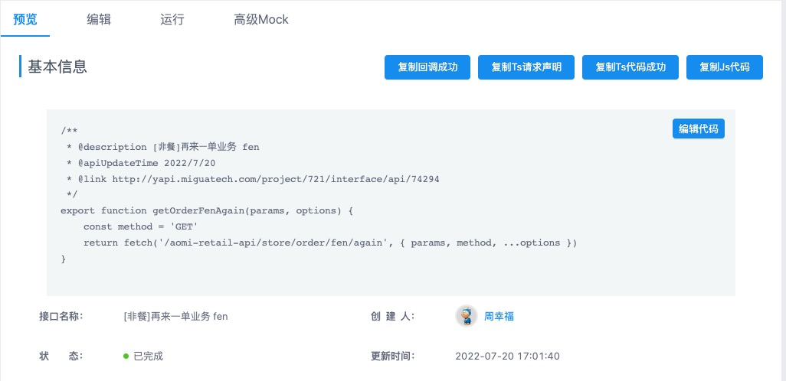
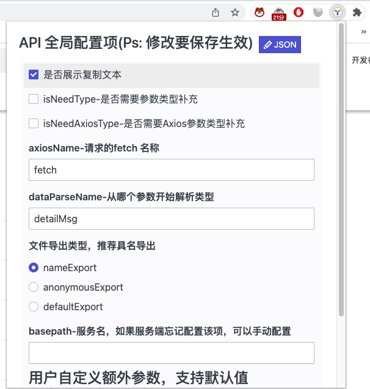

## copy-yapi

yapi 网站的 chrome 插件，方便复制单个接口代码。支持JS/TS、Ts的请求声明和回调声明


### Api配置(仅供参考，详细请看上方参考地址)

配置参考: [https://github.com/huangyijan/yapi-codegen](https://github.com/huangyijan/yapi-codegen)

|参数名称|类型|默认值|备注|
|---|---|---|---|
|axiosFrom|string|import fetch from 'axios'|这里配置自定义的请求目录，考虑到大部分时候我们都用axios的包，所以使用axios作为默认请求，你也可以使用自定义的请求。
|axiosName|string|fetch|这里配置自定义的请求Name,这里改成ssr的this指针挂载方式
|dataParseName|string|detailMsg|这里配置服务端统一返回的数据结构开始序列的对应key信息
|isNeedType|boolean|true|这里设置是否需要js doc类型，建议设置为true。会有非常完善的提示，来自后台的配置注释我迁移过来了
|isNeedAxiosType|boolean|true|这里设置是否需要axios的插件提示，默认为false, 如果设置为true, axios的额外配置项的类型提示将会是插件引入的axios提示.
|customerSnippet|string[]||用户自定义片段，字符串数组，每项占据一行
|customParams|Array<{name: string, default: ''}>||这里设置自定义的参数类型，该类型会添加进入请求的形参,支持传入任意数量形参，建议使用project里面的来定义，可能存在同一个项目调用不同的业务线api的情况
|outputStyle|string|defaultExport|支持值defaultExport, nameExport, anonymousExport,分别对应了默认导出，具名导出，匿名函数导出

### 使用方法


1、首先克隆代码主分支到本地

```bash
$ git clone --branch master --depth=1 http://github.miguatech.com/huangyijian/copy-api 

```

2、目前扩展配置的正则域名为：*://*/project/*/interface/api/* 。如果yapi服务搭建在二级目录上，请手动更改正则（文件位置： manifest.json）。

3、chrome 进入扩展管理，点击加载已解压的扩展程序，选择刚刚clone的文件夹，选择加载。

4、进入接口界面，看到代码复制按钮（点击插件图标，配置自定义选项）,完毕。



